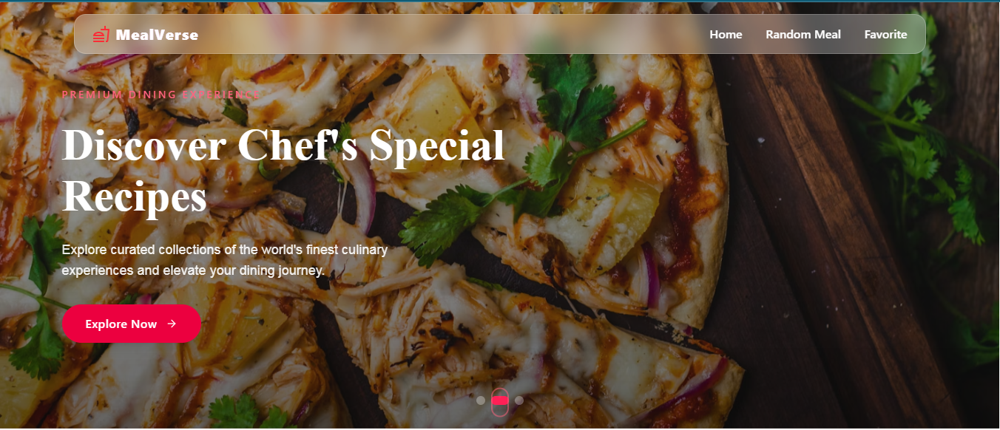

# MealVerse - Culinary Discovery App

 

MealVerse is a modern recipe discovery application that helps users explore, save, and cook delicious meals from around the world. With beautiful visuals and intuitive filtering, it's designed to inspire your culinary journey.

## ✨ Key Features

-  Discover thousands of recipes with rich details
-  Lightning-fast search with instant results
-  Save favorites with elegant bookmarking
-  Random meal generator for inspiration
-  Filter by categories, ingredients, and more
-  Fully responsive design
-  Stunning visual animations and transitions

## 🛠️ Technologies Used

-  React 18
-  Vite 4
-  Tailwind CSS + Framer Motion
-  Redux Toolkit for state management
-  React Icons
-  React Router DOM
-  TheMealDB API

## 🚀 Setup Instructions

### Prerequisites
- Node.js (v16 or higher)
- npm 

### Installation
1. Clone the repository:
   ```bash
   git clone https://github.com/masum-abrar/mealverse.git